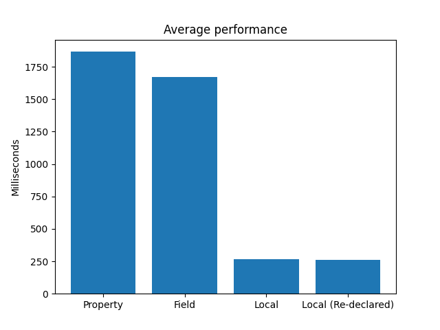

# Variable Scope Performance Impact in Unity C# Scripts

I'm working on a character controller that consists of a huge class.

I should not be worrying about micro-optimizations but I was curious whether I should save a lot of values as fields or local variables.

Starting hypotheses:

1. Properties are gonna be slower
2. Re-defining the variable at each iteration is probably going to be more costly than having it persist all iterations

Findings:

1. Properties are indeed the slowest of the bunch
2. Fields are not that much more performant
3. The two local variable tests are basically the same, with the reallocation winning by a handful of milliseconds
   - Performance lost during writeback/due to branch prediction?
   - Not really important since variables declared during update are going to be reallocated anyway

Average results (rounded to closest integer)

| Test                    |  Ms  |
| :---------------------- | :--: |
| Property                | 1866 |
| Field                   | 1669 |
| Local Var               | 267  |
| Local Var (Re-declared) | 262  |

Disclaimer: this experiment is based on the work of [Jackson Dunstan](https://www.jacksondunstan.com/articles/2968), to which I only added the fourth option
